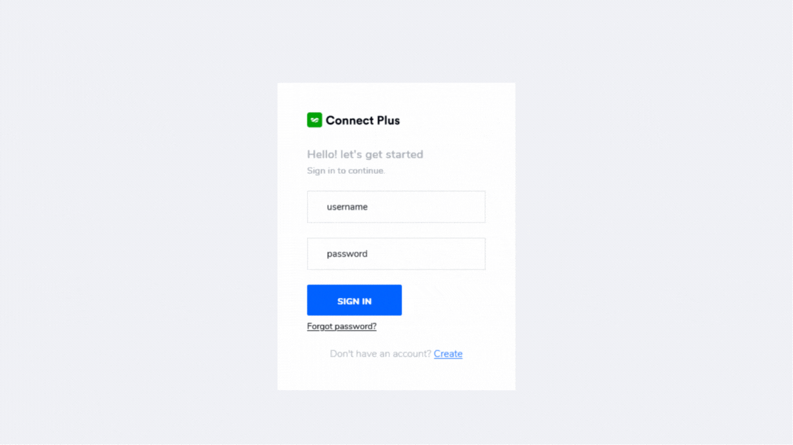

# webhosting-platform

A webhosting platform building using Django Web Framework, Docker, Jenkins which lets you host upto 5 subdomain and 1 mysql database will be auto provisined for each user.

## Features

- User Registeration / Login
- Email Validation
- Password Reset
- Register upto 5 subdomains of user's choice
- 1 MySQL database auto provisioned for each user's at the time of Email verification with limited permissions.
- Upload website's file to each subdomain owned by the user.
- Incident(s) notification to admin.

## Missing Files / Infrastructure

- Jenkins job(s) specific shell scripts
- docker-compose.yml file
  - nginx reverse proxy server
  - apache2
  - jenkins
  - cloudflared ( Zero Trust Tunnel )
